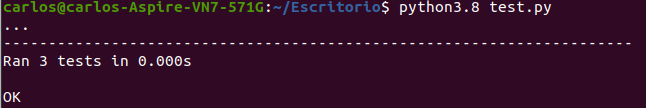
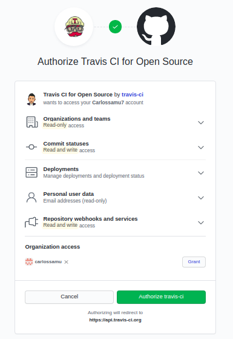

# TEMA 2: Desarrollo basado en pruebas
## Ejercicios de autoevaluación

**1. Instalar alguno de los entornos virtuales de `node.js` (o de cualquier otro lenguaje con el que se esté familiarizado) y, con ellos, instalar la última versión existente, la versión *minor* más actual de la 4.x y lo mismo para la 0.11 o alguna impar (de desarrollo).**

El entorno virtual que he instalado para `node.js` es `nvm`, mediante la orden:

`wget -qO- https://raw.githubusercontent.com/nvm-sh/nvm/v0.36.0/install.sh | bash`


Posteriormente usando `nvm install` instalamos aquella versión que queramos. En primer lugar la versión *minor* 4.9.1:


y por último la versión impar 0.11:


**2. Crear una descripción del módulo usando `package.json`. En caso de que se trate de otro lenguaje, usar el método correspondiente.**

El gestor de paquetes elegido es `npm` (versión 6.14.4) y comienzo creando el `package.json` mediante `npm init`.

Algunas órdenes útiles para cambiar datos de la descripción pueden ser:

`npm set init.author.email "example-user@example.com"`

`npm set init.author.name "example_user"`

`npm set init.license "MIT"`

Para instalar paquetes y dependencias he investigado un poco [aquí](https://docs.npmjs.com/cli/install) y voy a usar la orden `npm install [<@scope>/]<name>@<version>` para el paquete por ejemlo `sax` versión `0.1.1`. Por tanto,

`npm install sax@0.1.1`


**3. Descargar el repositorio de ejemplo anterior, instalar las herramientas necesarias (principalmente `Scala` y `sbt`) y ejecutar el ejemplo desde `sbt`. Alternativamente, buscar otros marcos para `REST` en `Scala` tales como `Finatra` o `Scalatra` y probar los ejemplos que se incluyan en el repositorio.**

He seguido este [tutorial](https://www.techrepublic.com/article/how-to-install-sbt-on-ubuntu-for-scala-and-java-projects/). Tal y como indica el [repositorio](https://github.com/JJ/spray-test) es necesario que la versión de Java sea la 8 y la de scala sea la 2.11. Para ello instalo `JDK v8`:

`sudo apt install openjdk-8-jdk`

y cambio de la versión antigua a esa continuación

`update-alternatives --config java`.

A continuación para `Scala`:

`sudo wget www.scala-lang.org/files/archive/scala-2.11.8.deb`

`sudo dpkg -i scala-2.11.8.deb`

y se comprueba con `scala -version`. Finalmente, se clona el repositorio, se ejecuta `sbt`, `test` (para compilar) y `re-start` (para lanzar la aplicación).


En el puerto `8088` de `localhost` observamos:


Asimismo podemos hacer algunas pruebas:


**4. Para la aplicación que se está haciendo, escribir una serie de aserciones y probar que efectivamente no fallan. Añadir tests para una nueva funcionalidad, probar que falla y escribir el código para que no lo haga. A continuación, ejecutarlos desde *mocha* (u otro módulo de test de alto nivel), usando descripciones del test y del grupo de test de forma correcta. Si hasta ahora no has subido el código que has venido realizando a GitHub, es el momento de hacerlo, porque lo vamos a necesitar un poco más adelante.**

Se han realizado algunos test de prueba con `unittest` en `Python`. El código ejemplo está sacado de este [link](https://docs.python.org/3/library/unittest.html).

```
import unittest

class TestStringMethods(unittest.TestCase):

    def test_upper(self):
        self.assertEqual('foo'.upper(), 'FOO')

    def test_isupper(self):
        self.assertTrue('FOO'.isupper())
        self.assertFalse('Foo'.isupper())

    def test_split(self):
        s = 'hello world'
        self.assertEqual(s.split(), ['hello', 'world'])
        # check that s.split fails when the separator is not a string
        with self.assertRaises(TypeError):
            s.split(2)

if __name__ == '__main__':
    unittest.main()
```

El resultado de la ejecución es el siguiente:



**5. *Ejercicio*: Haced los dos primeros pasos antes de pasar al tercero.**

- Me registro a través de mi cuenta de GitHub.



- Doy acceso al [repositorio](https://github.com/Carlossamu7/CC1-Conservatorio) del proyecto.

- Creo el fichero `.travis.yml` para el lenguaje de programación Python indicando aquellas versiones que quiero:

```
language: python
python:
  - "3.5"
  - "3.6"
  - "3.7"
  - "3.8"

# command to install dependencies
install:
  - pip install -r requirements.txt

# command to run tests
script:
  - pytest
```
