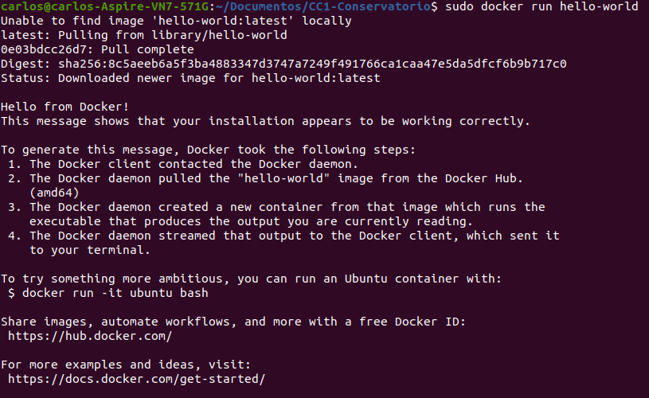
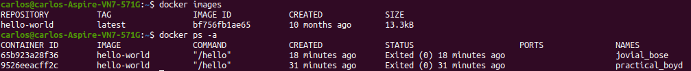
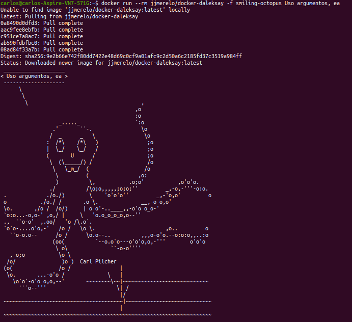
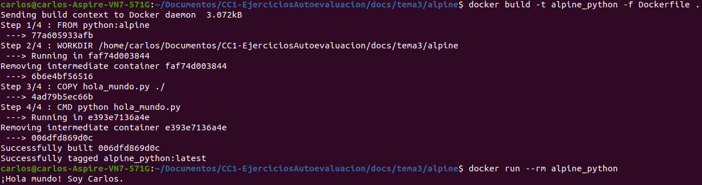
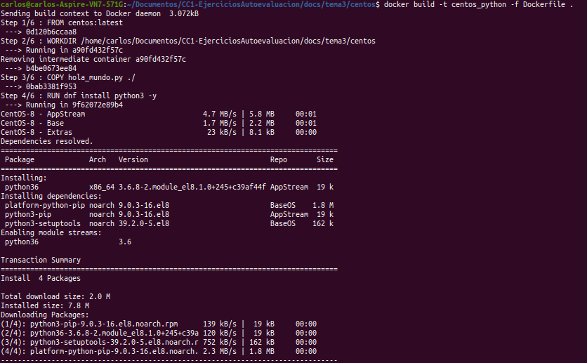
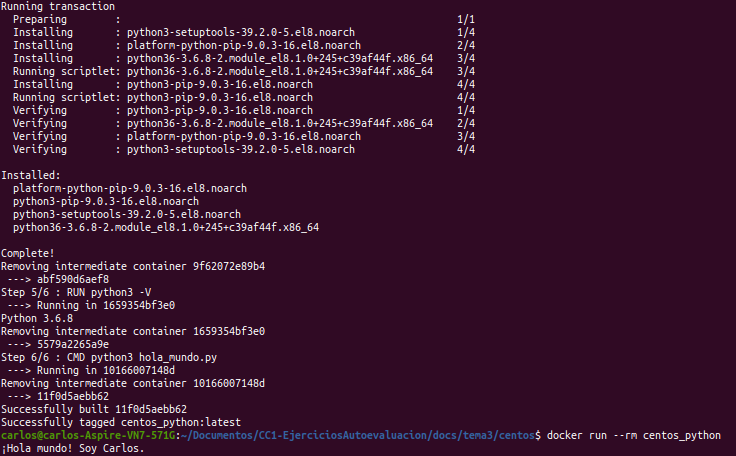
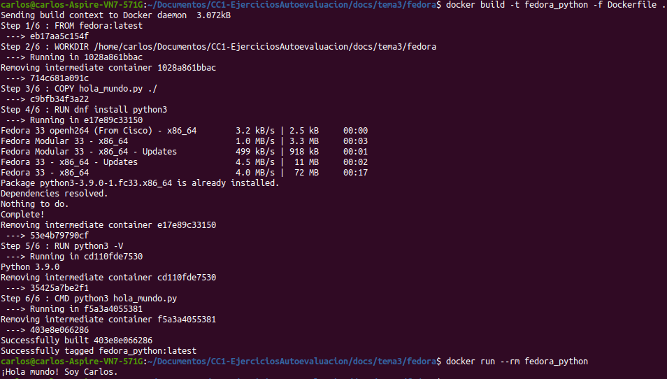
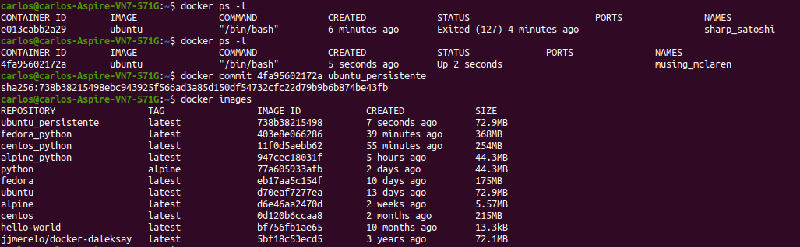

# TEMA 3: Usando contenedores
## Ejercicios de autoevaluación

**1. Buscar alguna demo interesante de Docker y ejecutarla localmente, o en su defecto, ejecutar la imagen anterior y ver cómo funciona y los procesos que se llevan a cabo la primera vez que se ejecuta y las siguientes ocasiones..**

En primer lugar realizamos la instalación siguiendo [este tutorial](https://docs.docker.com/engine/install/ubuntu/). Comprobamos que está bien instalado con

```
docker --version
```

en mi caso tengo la `19.03.13`. Ejecutamos el docker `hello-world`:

```
sudo docker run hello-world
```



Para no tener que usar `docker` con permisos `sudo` podemos hacer lo [siguiente](https://docs.docker.com/engine/install/linux-postinstall/#manage-docker-as-a-non-root-user).

```
sudo groupadd docker
sudo usermod -aG docker $USER
newgrp docker
sudo chown "$USER":"$USER" /home/"$USER"/.docker -R
sudo chmod g+rwx "$HOME/.docker" -R
```

Finalmente configuramos docker para activarse con el arranque:

```
sudo systemctl enable docker
sudo systemctl disable docker
```

Podemos listar las imágenes y los contenedores que tenemos con las respectivas órdenes:

```
docker images
docker ps -a
```



Para crear un contenedor de *usar y tirar* lanzamos la orden:

```
docker run --rm hello-world
```

que borrará el contenedor creado una vez ejecutada la orden. De este modo, se mantiene el número de contenedores bajo y sobre todo se guardan solo y exclusivamente los que se piensen mantener o trabajar más adelante.

Por último, realizamos otra prueba imprimiendo un pulpo sonriente:

```
docker run --rm jjmerelo/docker-daleksay -f smiling-octopus Uso argumentos, ea
```



**2. Tomar algún programa simple, “Hola mundo” impreso desde el intérprete de línea de órdenes, y comparar el tamaño de las imágenes de diferentes sistemas operativos base, Fedora, CentOS y Alpine, por ejemplo.**

El programa "Hola mundo" es en Python, fichero [hola_mundo.py](./docs/tema3/alpine/hola_mundo.py), y el contenido es:

```
print("¡Hola mundo! Soy Carlos.")
```

##### Alpine #####

El Dockerfile es el siguiente:

```
FROM python:alpine

WORKDIR /home/carlos/Documentos/CC1-EjerciciosAutoevaluacion/docs/tema3/alpine

COPY hola_mundo.py ./

CMD python hola_mundo.py
```

Para construir el contenedor y hacerlo correr ejecutamos:

```
docker build -t alpine_python -f Dockerfile .
docker run --rm alpine_python
```



##### CentOS #####

El Dockerfile es el siguiente:

```
FROM centos:latest

WORKDIR /home/carlos/Documentos/CC1-EjerciciosAutoevaluacion/docs/tema3/centos

COPY hola_mundo.py ./

RUN dnf install python3 -y

RUN python3 -V

CMD python3 hola_mundo.py

```

Se ha ejecutado una orden para ver la versión de `Python3` instalada es la `3.6.8`. Para construir el contenedor y hacerlo correr ejecutamos:

```
docker build -t centos_python -f Dockerfile .
docker run --rm centos_python
```




##### Fedora #####

El Dockerfile es el siguiente:

```
FROM fedora:latest

WORKDIR /home/carlos/Documentos/CC1-EjerciciosAutoevaluacion/docs/tema3/fedora

COPY hola_mundo.py ./

RUN dnf install python3

RUN python3 -V

CMD python3 hola_mundo.py
```

Se ha ejecutado una orden para ver la versión de `Python3` instalada es la `3.9.0`. Para construir el contenedor y hacerlo correr ejecutamos:

```
docker build -t fedora_python -f Dockerfile .
docker run --rm fedora_python
```



La comparación de tamaños es la siguiente:


**3. Crear a partir del contenedor anterior una imagen persistente con `commit`.**

En mi caso lo he hecho para el contenedor que tengo de ubuntu. He ejecutado `docker ps -l`, cojo el ID del contenedor que quiero hacer persistente y posteriormente ejecuto `docker commit ID ubuntu_persistente`. Observemos:



La nueva imagen `ubuntu_persistente` está creada.

**4. Examinar la estructura de capas que se forma al crear imágenes nuevas a partir de contenedores que se hayan estado ejecutando.**

**5. Crear un volumen y usarlo, por ejemplo, para escribir la salida de un programa determinado.**

**6. Usar un miniframework REST para crear un servicio web y introducirlo en un contenedor, y componerlo con un cliente REST que sea el que finalmente se ejecuta y sirve como “frontend”.**

**7. Reproducir los contenedores creados anteriormente usando un `Dockerfile`.**

**8. Crear con docker-machine una máquina virtual local que permita desplegar contenedores y ejecutar en él contenedores creados con antelación.**
