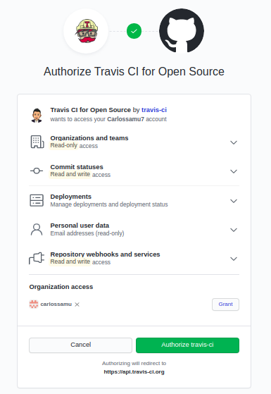

# TEMA 4: Integración continua
## Ejercicios de autoevaluación

**1. *Ejercicio*: Haced los dos primeros pasos antes de pasar al tercero.**

- Me registro a través de mi cuenta de GitHub.



- Doy acceso al [repositorio](https://github.com/Carlossamu7/CC1-Conservatorio) del proyecto.

**2. Configurar integración continua para nuestra aplicación usando Travis o algún otro sitio.**

Creo el fichero `.travis.yml` para el lenguaje de programación Python indicando aquellas versiones que quiero:

```
#Lenguaje de programación
language: python

# Versiones (de momento)
python:
  - "3.6"
  - "3.7"
  - "3.8"

# Instala dependencias
install:
  - make install

# Ejecuta los tests
script:
  - make test
```

Observamos la etiqueta:

[](https://travis-ci.org/github/Carlossamu7/CC1-Conservatorio)
