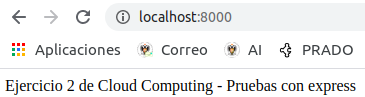
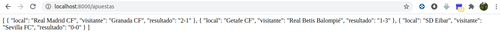
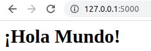
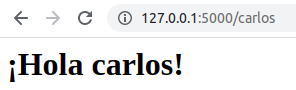
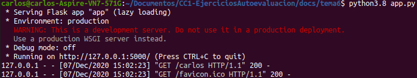
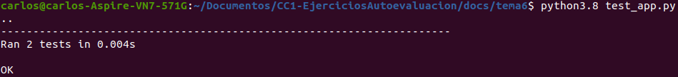
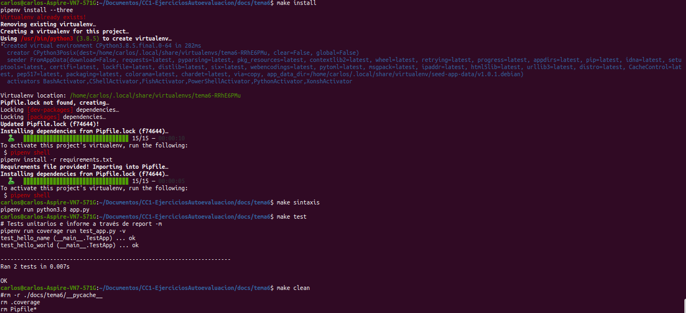

# TEMA 6: Microservicios
## Ejercicios de autoevaluación

**1.Instalar `etcd3`, averiguar qué bibliotecas funcionan bien con el lenguaje que estemos escribiendo el proyecto (u otro lenguaje), y hacer un pequeño ejemplo de almacenamiento y recuperación de una clave; hacer el almacenamiento desde la línea de órdenes (con `etcdctl`) y la recuperación desde el mini-programa que hagáis.**

Sol.

**2. Realizar una aplicación básica que use `express` para devolver alguna estructura de datos del modelo que se viene usando en el curso.**

He elegido el modelo de las apuestas. A continuación se muestra el código, cuyo fichero está [aquí](./docs/tema6/express/app.js).

```
var express = require('express');
var app = express();
const PORT = process.env.PORT || 8000;

app.set('port', PORT);

app.use('/apuestas', (req, res) => {
    let songs = [
        {
            local: 'Real Madrid CF',
            visitante: 'Granada CF',
            resultado: '2-1'
        },
				{
            local: 'Getafe CF',
            visitante: 'Real Betis Balompié',
            resultado: '1-3'
        },
				{
            local: 'SD Eibar',
            visitante: 'Sevilla FC',
            resultado: '0-0'
        }
    ];
    res.send(JSON.stringify(songs, null, 3));
})

app.get('',
	function(req,res){
		res.send("Ejercicio 2 de Cloud Computing - Pruebas con express");
	}
);

app.listen(PORT,
	function() {
		console.log("La aplicación se está ejecutando en localhost:" + app.get('port'));
	}
);
```

Al acceder a http://localhost:2000/:



Al acceder a http://localhost:2000/apuestas:



**3. Programar un microservicio en express (o el lenguaje y marco elegido) que incluya variables como en el caso anterior.**

He usado el *framework* `Flask` en `Python` de cara a familiarizarme con eĺ. Esto puede ser muy útil para el proyecto. En primer lugar lo instalo con `pip3 install flask`. He programado un *Hola Mundo* y un *Hola Nombre* que usa la dirección escogida como nombre. Veamos:

```
from flask import Flask
app = Flask(__name__)

@app.route('/')
def hello_world():
    return '<h1>¡Hola Mundo!</h1>'

@app.route('/<nombre>')
def hello_name(nombre):
    return '<h1>¡Hola {}!</h1>'.format(nombre)

if __name__ == "__main__":
    app.run()
```

Al acceder a http://127.0.0.1:5000/:



Al acceder a http://127.0.0.1:5000/carlos:



En la terminal observaríamos:



[Consultar código de `app.py`](./docs/tema6/app.py).

**4. Crear pruebas para las diferentes rutas de la aplicación.**

Se han implementado un par de test unitarios para comprobar que `app.py` hace lo que tiene que hacer.

```
from app import app
import unittest

class TestApp(unittest.TestCase):

    def setUp(self):
        self.app = app.test_client()

    def test_hello_world(self):
        response = self.app.get('/')
        self.assertEqual(response.status_code, 200)
        self.assertIn(b'Hola Mundo!', response.data)

    def test_hello_name(self):
        response = self.app.get('/carlos')
        self.assertEqual(response.status_code, 200)
        self.assertIn(b'Hola carlos!', response.data)

if __name__ == '__main__':
    unittest.main()
```

En la terminal observaríamos:



[Consultar código de `test_app.py`](./docs/tema6/test_app.py).

**5. Experimentar con diferentes gestores de procesos y servidores web front-end para un microservicio que se haya hecho con antelación, por ejemplo en la sección anterior.**

Sol.

**6. Usar rake, invoke o la herramienta equivalente en tu lenguaje de programación para programar diferentes tareas que se puedan lanzar fácilmente desde la línea de órdenes.**

```
# Instala las dependencias
install: requirements.txt
	pipenv install --three
	pipenv install -r requirements.txt

# Comprueba sintaxis
sintaxis:
	pipenv run python3.8 app.py

# Ejecuta los tests
test:
	# Tests unitarios e informe a través de report -m
	pipenv run coverage run test_app.py -v
	#pipenv run coverage report -m

# Borra ficheros creados
clean:
	#rm -r ./docs/tema6/__pycache__
	rm .coverage
	rm Pipfile*
```

Fichero `requirements.txt` con las dependencias de esta aplicación.

```
Flask==1.1.2
pipenv==11.9.0
coverage==5.3
```

En la terminal observaríamos:



[Consultar código de `Makefile`](./docs/tema6/Makefile).
