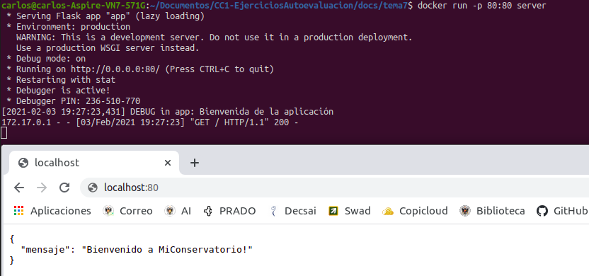
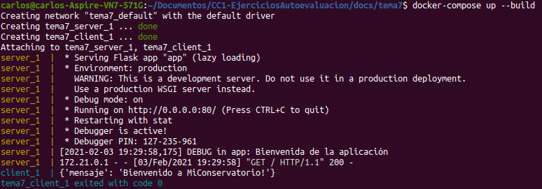

# TEMA 7: Composición de contenedores
## Ejercicios de autoevaluación

**1. Crear un pod con dos o más contenedores, de forma que se pueda usar uno desde el otro. Uno de los contenedores contendrá la aplicación que queramos desplegar.**

He [instalado podman](https://podman.io/getting-started/installation) y consultado este [enlace](https://www.vultr.com/docs/how-to-install-and-use-podman-on-ubuntu-20-04).

Algunas órdenes básicas a tener en cuenta:
```
podman images
podman run hello-world
podman ps -a
podman stop --latest
podman start --latest
podman rm --latest
```

Para guardar los cambios de un contenedor:
```
podman commit \
       --message "Statement of changes" \
       --author "Author Name <example@example.com>" \
       <cntnr_id> repository/new_name
```

Para pushear los cambios:
```
podman login docker.io
podman push <image_id> <docker-registry-username>/<docker-image-name>
```


**2. Usar un miniframework REST para crear un servicio web y introducirlo en un contenedor, y componerlo con un cliente REST que sea el que finalmente se ejecuta y sirve como "frontend".**

Voy a usar como servidor el disponible en [este proyecto](https://github.com/Carlossamu7/CC1-Conservatorio) que he desarrollado en Python.

El cliente es el siguiente:

```
print(requests.get("http://172.17.0.1:80/", verify=True).json())
```

El Dockerfile del cliente es sencillo (se utiliza `requirements_client.txt`):

```
# Imagen base
FROM python:3.8-slim

# Etiqueta que indica el mantenedor
LABEL maintainer="carlossamu7@gmail.com"

# Creación de un usuario sin permisos, carpeta y actualización de pip
RUN useradd -m -s /bin/bash nonrootuser \
    && python3 -m pip install --upgrade pip \
    && apt-get update

# Directorio de trabajo
WORKDIR .

# Fichero con los paquetes necesarios
COPY ./src/client.py requirements_client.txt ./

# Instalación de paquetes
RUN pip install -r requirements_client.txt \
    && rm requirements_client.txt

# Usamos el usuario creado
USER nonrootuser

# Abrir puerto 5001
EXPOSE 8001

CMD ["python3", "client.py"]
```

Construyo los contenedores a partir de los Dockerfiles:

```
docker build -f execute.Dockerfile -t server .
docker build -f client.Dockerfile -t client .
```

Con la siguiente orden podría ejecutar el contenedor del servidor:

```
docker run -p 80:80 server
```

Observamos la correcta conexión:



El fichero `docker-compose.yml` diseñado es el que encontramos a continaución:

```
version: '3'
services:
  server:
    image: server
    restart: always
    ports:
    - "80:80"

  client:
    image: client
    stdin_open: true
    depends_on:
      - server
    links:
      - server
    ports:
    - "8001:8001"

```

Levanto la composición:

```
docker-compose up --build
```

El resultado es el esperado:



Consultar el código [aquí](https://github.com/Carlossamu7/CC1-EjerciciosAutoevaluacion/tree/main/docs/tema7).
